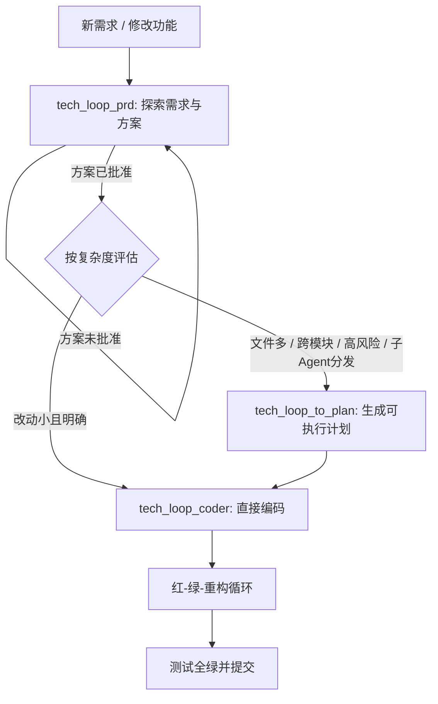

# tech-loop-skills

一套用于约束 AI 编程工作流的技能（Skills）集合。它把一次功能开发拆成“需求确认 → 可执行计划 → TDD 实现”的标准链路，并用前置关卡、测试门禁和提交粒度来降低 AI 在编码过程中的方向偏离、凭空假设和范围蔓延。

本仓库不是可直接运行的程序，而是技能源文件。每个主技能对应一个目录，目录中的 `SKILL.md` 是技能入口；其余 `.md` 文件是主技能在工作时会引用的配套指南。

---

## 1. 项目要解决什么问题

直接让 AI “写一个功能”时，常见的问题包括：

- 需求还没确认，AI 就开始写代码，方向错了浪费大量时间。
- 多文件、多模块改动没有被拆分，实现顺序和类型契约不可控。
- 写代码时一次写完所有逻辑，缺少“测试先行、小步实现、持续重构”的节奏。
- 测试 mock 了内部对象、测了私有方法，导致重构很容易把测试写坏。
- 改动跨多个系统时，没有先规划文件和依赖，执行智能体只能反复猜测。

本仓库通过三个主技能形成开发门禁：

```text
tech_loop_prd
    ↓ 需求与方案经用户确认
tech_loop_to_plan（仅复杂任务走此关卡）
    ↓ 生成可执行计划
tech_loop_coder
    ↓ 红-绿-重构循环 + 可验证提交
完成
```



---

## 2. 目录结构

```text
.
├── README.md
└── skills
    ├── tech_loop_prd
    │   └── SKILL.md                     # 需求分析与方案设计关卡
    ├── tech_loop_to_plan
    │   └── SKILL.md                     # 规格到可执行计划
    └── tech_loop_coder
        ├── SKILL.md                     # TDD 红-绿-重构循环
        ├── design-an-interface.md       # 接口/API 方案设计
        ├── mock.md                      # Mock 边界规则
        ├── refactor.md                  # 代码重构检查与流程
        ├── tests.md                     # 优质测试与劣质测试对照
        └── to-DDD.md                    # 统一领域语言
```

---

## 3. 主技能总览

| 技能 | 一句话作用 | 什么时候进入 | 输入 | 输出 |
|------|-----------|--------------|------|------|
| `tech_loop_prd` | 在写代码前确认需求和方案 | 任何新增、构建、修改功能或组件之前 | 用户需求、现有代码、业务背景 | 经用户审核的方案/设计说明 |
| `tech_loop_to_plan` | 把已确认方案拆成智能体可执行计划 | 规格化、多步骤、多文件、跨模块或高风险任务 | 已确认的方案文档/规格 | 含完整代码与命令的可执行计划 |
| `tech_loop_coder` | 按 TDD 实现方案或修复缺陷 | 已有明确方案，开始编码、补测试、重构时 | 方案文档或执行计划 | 测试通过的代码 |

建议的调用顺序是：

1. 先让 `tech_loop_prd` 梳理需求并确认方案，未批准前不写代码。
2. 方案批准后，用 `tech_loop_to_plan` 的“触发条件矩阵”判断复杂度：
   - 不满足条件：跳过 to-plan，直接把方案加载为编码上下文。
   - 满足条件：先生成计划，再按计划执行。
3. 进入 `tech_loop_coder`，按一个测试、一段实现、一次重构的节奏推进。

---

## 4. tech_loop_prd：设计前置关卡

### 作用

这是所有创意工作的强制入口。它避免 AI 在需求尚不明确时直接编码，负责：

- 根据痛点、业务背景和现有代码理解需求。
- 将需求拆分任务，并分析实现方案细节。
- 在进入实现前让用户审核方案，形成明确的设计说明。

### 适用场景

- 创建、构建、添加、修改功能或组件。
- 需求描述含糊，涉及多个系统或多个实现选择。
- 用户要求先分析需求、出方案再动手。

### 核心工作流

| 步骤 | 动作 | 关键约束 |
|------|------|----------|
| 1 | 探上下文：阅读代码、提交历史与项目结构 | 不熟悉项目时不直接出方案 |
| 2 | 分范围：多系统拆成子项目，确定关系顺序 | 拆分粒度以系统为单位 |
| 3 | 抓疑问：逐个询问不确定项并给出首选答案 | 一次只问一个问题 |
| 4 | 给出 2-3 个候选方案 | 方案需对比优缺点并给出推荐理由 |
| 5 | 按“架构→组件→流→错误→测试”展示设计 | 每节需要用户确认是否可接受 |
| 6 | 规格自检：检查 TODO、矛盾、歧义、范围 | 有缺口先修复 |
| 7 | 用户审核规格 | 批准前不得继续 |
| 8 | 写详细设计文档 | 与用户确认是否保存以及保存位置 |

### 关键规则

- 一次只问一个问题，且先给出推荐选项。
- 遵守 YAGNI，只实现明确需求，不夹带未授权功能。
- 遵循接口优先、探索现有代码结构的原则。
- 不做方案对比就不进入设计；用户不批准就不进入实现。
- 如果设计连续被否 3 次，暂停并让用户重新理清需求。

### 如何使用

在 AI 开始写代码前，直接提出“先进入方案设计”的请求，例如：

> “先用 tech_loop_prd 分析这个需求，确认方案后再编码。”
>
> “这个模块要新增 XX 功能，请先探索现有代码并给出 2-3 个实现方案。”

AI 会按该技能的步骤逐项推进，并在关键决策点停下来征求用户确认。

---

## 5. tech_loop_to_plan：规格到可执行计划

### 作用

把“概念级描述”转化为“智能体可以直接粘贴代码、运行命令”的执行计划。计划需要明确文件结构、任务依赖、共享契约、测试命令、定位锚点和提交粒度，目标是让执行智能体的“自我发现”降到零。

### 适用场景

- 已有规格或方案文档，任务是多步骤的。
- 预计修改 4 个以上文件。
- 改动跨 2 个以上模块。
- 涉及资金、合规、数据迁移、存量数据兼容等高风控场景。
- 任务需要分发给多个子 Agent、多会话或多轮执行。

### 是否走 to-plan 的评估矩阵

| 评估维度 | 直接进入 coder | 建议走 to-plan |
|----------|----------------|----------------|
| 文件数 | ≤ 3 个文件 | ≥ 4 个文件 |
| 设计文档粒度 | 已含接口签名、伪代码、实体定义 | 只有概念性文字描述 |
| 跨模块数 | 单模块内 | 跨 2 个以上模块 |
| 风险等级 | 纯新增，不影响存量数据和流程 | 资金、合规、数据迁移、存量兼容 |
| 执行方式 | 单人单会话一次跑完 | 多人/多会话/子 Agent 分发 |

决策规则概括为：`文件数 ≥ 4` 或 `跨模块数 ≥ 2` 或 `高风险` 或 `需要分发` 时走 to-plan；否则跳过 to-plan，直接把方案作为 `tech_loop_coder` 的上下文。

### 核心工作流

| 步骤 | 动作 |
|------|------|
| 0 | 按触发条件矩阵判断是否执行本技能 |
| 1 | 范围检查：多子系统拆成独立计划 |
| 2 | 确定文件结构，一文件一职责，按业务拆分 |
| 3 | 任务分解：每步 2-5 分钟工作量，一个操作一步 |
| 3.5 | 提取跨任务共享契约，统一定义类型、枚举、DTO、映射器 |
| 4 | 写计划头：目标、架构、技术栈、范围边界 |
| 4.5 | 写上下文预读清单与任务依赖关系表 |
| 5 | 写任务：每个任务都包含路径、完整测试、完整实现和提交命令 |
| 6 | 自检：规格覆盖、无占位符、类型一致、契约完备、锚点可定位 |
| 7 | 保存并让用户审核，可选子 Agent 复审 |
| 8 | 选择执行方式：子 Agent 或内联执行 |

### 计划中每个任务的固定结构

每个任务都按以下 5 步展开，不允许删减或合并：

1. 写失败测试（完整测试代码）。
2. 运行测试，预期失败。
3. 写最小实现（完整实现代码）。
4. 运行测试，预期通过。
5. 提交代码。

### 如何使用

当方案已经确认且任务复杂时，要求 AI 先生成计划，例如：

> “这个方案已经确认，请用 tech_loop_to_plan 生成可执行实现计划。”
>
> “下面需求要改 6 个文件和 2 个模块，先写成含任务依赖、契约、测试和提交步骤的计划。”

注意：本技能本身不负责写业务代码。它产出的计划会引用 `tech_loop_coder` 作为实现技能。

---

## 6. tech_loop_coder：红-绿-重构循环

### 作用

负责真正的编码实现。它采用测试驱动开发（TDD）的红-绿-重构循环：

- 红色：先写一个聚焦可观测行为的测试，运行并确认失败。
- 绿色：写满足当前测试的最少代码，让测试通过。
- 重构：测试全绿后改进结构，并保证行为不变。

核心理念是通过公共接口验证行为；测试不 mock 内部对象、不测私有方法、不直接查数据库。

### 适用场景

- 按已确认方案开发功能。
- 为现有方法或新行为编写单元测试、集成测试。
- 修复缺陷（先写复现测试再修复）。
- 根据方案设计接口。
- 梳理方案的领域模型。

### 工作流程

#### 1. 规划

- 用户没有明确技术方案时，先基于需求提出方案。
- 领域上下文需要时可以执行 `to-DDD.md` 维护统一领域语言。
- 与用户确认要修改的接口、要测试的行为及优先级。
- 方案获用户批准后才进入编码。

主动确认的问题示例：

> “公共接口应该是什么样？哪些行为是最重要的测试点？”

#### 2. 红-绿循环

```text
红色：编写测试 → 编译失败或测试失败
绿色：编写使测试通过的最简代码 → 编译通过且测试通过
```

- 一次只写一个测试。
- 只写满足当前测试的最少代码，不预判未来测试。
- 测试始终聚焦可观测行为。
- Bug 修复必须先写复现测试，再修复并回归验证。

#### 3. 重构

- 检查代码重复、过长方法、职责单薄或分散、特征依恋、基础类型滥用等坏味道。
- 所有测试通过后才能重构；红色阶段不得重构。
- 每步重构后运行测试；跨模块影响则运行全量测试。

### 禁止模式

| 禁止行为 | 正确做法 |
|----------|----------|
| 水平切片：先写完所有测试再写代码 | 垂直切片：一个测试 + 一段实现重复推进 |
| 用 `@SpringBootTest` 测纯逻辑 | 纯逻辑用 JUnit + Mockito 等轻量方式 |
| Mock 内部协作对象 | 只 Mock 系统边界 |
| 用反射测私有方法 | 通过公共接口验证行为 |

### 如何使用

编码阶段可以直接提出 TDD 要求，例如：

> “按 tech_loop_coder 的流程，为这个功能先写测试再实现。”
>
> “按确认过的方案实现这个方法，并用红-绿-重构循环推进。”
>
> “修复这个 bug，先写一个能复现的失败测试。”

---

## 7. tech_loop_coder 配套指南

以下文件不是独立入口技能，而是 `tech_loop_coder` 在具体场景中会读取的配套规则。

### 7.1 design-an-interface.md：接口设计方案

**作用**

为 API、接口、方法设计提供流程约束：先梳理需求，再并行产出至少 3 个差异明显的候选方案，从简洁度、适用范围、性能、模块深度、容错性等角度对比后选定方案。

**何时使用**

- 设计模块接口或 API。
- 对接口方案做选型。
- 对比模块架构方案。
- 用户要求给出多种设计。

**核心约束**

- 至少启动 3 个子智能体产出风格不同的方案，禁止同质方案。
- 必须做方案对比。
- 只设计接口架构，不写实现代码。
- 遵循项目 RESTful 规范和命名约定。
- 设计要考虑可测试性：接收依赖、返回结果，而不是内部创建依赖并产生难测副作用。

**典型请求**

> “为 XX 模块设计接口，给出几种不同方案并对比。”

### 7.2 mock.md：Mock 使用边界

**作用**

明确什么能 mock、什么不能 mock，以及如何把代码设计成可 mock 的结构。

**何时使用**

- 编写测试时不确定某个依赖是否应该 mock。
- 对外部 API、数据库、时间、文件系统等边界依赖做测试隔离。

**规则**

只允许在系统边界处模拟：

- 外部 API，如支付、邮件。
- 数据库（优先使用测试数据库）。
- 时间或随机数。
- 文件系统。

不允许模拟自己的类、内部协作对象或任何由项目控制的对象。为了让代码可 mock，外部依赖应通过构造参数注入，而不是在内部创建；外部 SDK 应按操作拆成独立函数，而不是提供需要条件判断的通用获取器。

**典型请求**

> “写这个测试时，外部支付客户端应该 mock，其他内部服务不能 mock。”

### 7.3 tests.md：优质测试与劣质测试

**作用**

提供好测试与坏测试的对照标准，用于检查待写测试是否符合“公共 API + 可观测行为”原则。

**何时使用**

- 判断测试是否应该通过、为什么写出来没有价值。
- 重构时出现“行为没变但测试失败”的坏味道时。
- 新建或评审单元测试、集成测试。

**优质测试特征**

- 只测试外部可观测的“做什么”。
- 只使用公共 API。
- 每个测试聚焦一个断言。
- 重构代码时测试依然有效。

**劣质测试特征**

- mock 内部对象。
- 测私有方法。
- 断言方法调用次数或调用顺序。
- 与实现结构强耦合，行为不变时测试也会失败。

**典型请求**

> “按 tests.md 的标准检查这些测试是不是优质测试。”

### 7.4 refactor.md：代码重构

**作用**

规定重构前的质量检查项、历史代码的重构流程，以及重构期间的门禁。

**何时使用**

- 新功能代码完成、测试通过后做代码风格和结构整理。
- 为历史代码制定重构方案。
- 编写重构提案。

**新代码质量检查项**

- 代码重复 → 抽取独立方法或类。
- 方法过长 → 拆分为私有辅助方法，但只测公共接口。
- 模块职责单薄或分散 → 合并或扩充。
- 特征依恋 → 把逻辑迁移到数据所属的类。
- 基础类型滥用 → 引入值对象。
- 已有代码暴露的问题 → 一并修复。

**历史代码重构流程**

1. 用户阐述问题与初步思路。
2. 检索仓库，核实代码真实状态。
3. 给出备选方案并敲定细节。
4. 明确重构边界：改什么、不改什么。
5. 核查测试覆盖率，不足先补测试。
6. 拆成最小粒度提交节点，每步确保可运行。

**门禁**

- 所有测试通过后方可重构。
- 每一步重构后运行测试。
- 接口设计遵守 `design-an-interface.md`。

**典型请求**

> “功能测试全绿了，按 refactor.md 检查这段代码并做小步重构。”

### 7.5 to-DDD.md：统一领域语言

**作用**

从对话内容中提炼领域名词、动词和业务概念，形成统一术语表，消除“一词多义、用语不统一”等问题，并把标准术语写入 `/docs/architecture/service-map.md`。

**何时使用**

- 需要定义领域词汇、编制术语词典、规范用语。
- 领域模型不清晰，需要在实现前先统一术语。
- 团队或 AI 对同一个概念用了多种叫法。

**执行步骤**

1. 梳理对话，筛选领域相关名词、动词与业务概念。
2. 识别语义歧义、用语不统一、一词多义。
3. 敲定标准词汇，形成术语清单。
4. 写入或追加到 `service-map.md`。
5. 在对话中输出总结。

**文档格式**

```markdown
# 统一领域语言

## [业务板块]

| 标准术语 | 释义 | 禁用同义叫法 |
|---|---|---|
| **术语** | 业务含义 | 禁用词 |

## 业务关联关系
- 实体A → 实体B 对应规则

## 歧义标注
- 词汇A 同时指代 X 和 Y → 明确区分边界
```

**典型请求**

> “先用 to-DDD 梳理这个方案的领域术语，再继续编码。”

---

## 8. 技能间的配合方式

### 一个完整的轻量任务

```text
用户需求
→ tech_loop_prd 确认方案
→ 复杂度低，跳过 to-plan
→ tech_loop_coder 按 TDD 实现
```

### 一个完整的多文件任务

```text
用户需求
→ tech_loop_prd 确认方案
→ tech_loop_to_plan 生成计划（含契约、依赖、测试、提交）
→ tech_loop_coder 逐任务执行
→ 全量验证后提交
```

### 什么时候临时加辅助技能

| 遇到的情况 | 补充使用 |
|------------|----------|
| 领域术语混乱，模型不统一 | `to-DDD.md` |
| 尚未确定接口或 API 形态 | `design-an-interface.md` |
| 要写测试或评审测试 | `tests.md` + `mock.md` |
| 测试全绿但结构需要整理 | `refactor.md` |

---

## 9. 使用前提示

- 本仓库的每个主技能都包含“用户批准”检查点。用户没有确认时，不要越过关卡直接实现。
- `tech_loop_prd` 和 `tech_loop_to_plan` 都不以提交业务代码为目标；编码工作统一交给 `tech_loop_coder`。
- to-plan 计划要提供完整代码、测试命令和定位锚点，不能留下 TODO、占位符或“参考任务 N”这类模糊表述。
- 所有测试必须能通过公共 API 验证行为；内部实现变化不应导致测试被重写。
- 本仓库默认面向 Java 类技术栈示例（JUnit、Mockito、Spring Boot 等），但红-绿-重构、垂直切片、边界 mock、小步提交等原则可沿用到其他语言和框架。
